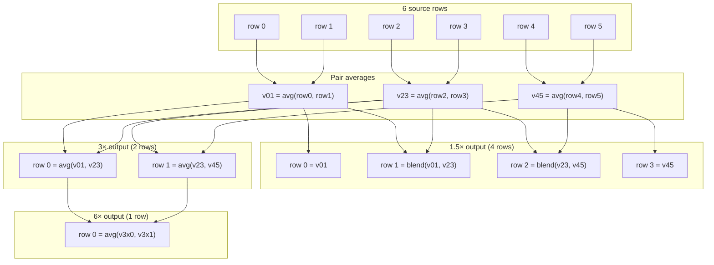
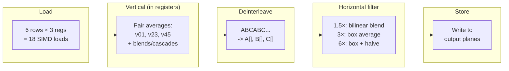
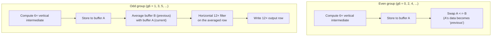
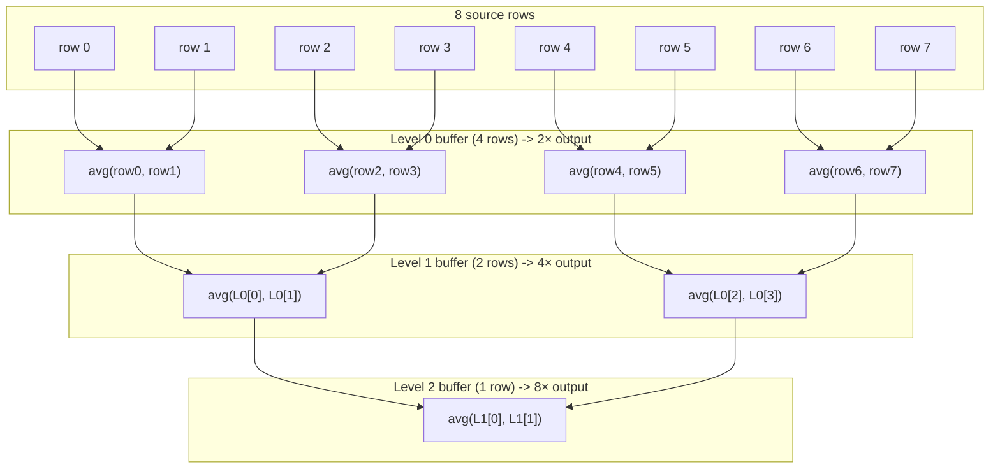
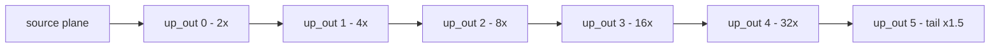

# Funnelcake Kernel Architecture

This document explains how funnelcake's downscale kernels work internally.
It assumes familiarity with YUV420/I420 planar video and basic downscaling
concepts but not SIMD intrinsics or the specific algorithms used here.

For the public API, see [API.md](API.md).


## I420 plane structure

I420 stores video as three separate planes:

```
┌─────────────────────┐
│     Y (luma)        │  width × height
│                     │
└─────────────────────┘
┌──────────┐
│  U (Cb)  │  width/2 × height/2
└──────────┘
┌──────────┐
│  V (Cr)  │  width/2 × height/2
└──────────┘
```

Each plane is scaled independently with the same kernel. The chroma planes
(U, V) are simply processed at half the luma dimensions in both axes.


## Scale families

Funnelcake supports two downscale families and an independent upscale
direction. A single scaler context uses one downscale family at a time
but may combine it with upscaling in the same init call.

| Direction | Family | Steps | Vertical period |
|-----------|--------|-------|-----------------|
| Downscale | **Thirds** | 1.5×, 3×, 6×, 12× | 6 source rows |
| Downscale | **Pow2**   | 2×, 4×, 8×, 16× | 2^n source rows |
| Upscale   | **Pow2 cascade** | 2×, 4×, 8×, 16×, 32× (+1.5× tail) | per-level (see [Upscale kernel architecture](#upscale-kernel-architecture)) |

The thirds downscale family uses a **fused** kernel - vertical and
horizontal reduction happen in the same pass over source memory. The
pow2 downscale family uses a **cascade** kernel - vertical reduction
into temporary buffers, then horizontal reduction from those buffers.

The upscale direction uses a **cascade** structure: each level reads
from the previous level's output buffer rather than from the source.
This amortizes source reads - the source is loaded exactly once (for
level 0 / 2×) regardless of how many upscale levels are requested.


## SIMD tiers

Three implementations exist for each family:

| Tier | Platform | SIMD width | Chunk size (thirds) |
|------|----------|------------|---------------------|
| AVX2 | x86-64 | 256-bit (YMM) | 96 bytes |
| NEON | aarch64 | 128-bit (Q) | 48 bytes |
| Scalar | any | - | 1 byte |

All three tiers produce identical output. The scalar tier is the reference
implementation and fallback.

---

## Thirds kernel: vertical reduction

The thirds kernel processes source rows in groups of 6. Each group
produces output rows for every active scale step:



### Output row formulas

| Step | Output rows per 6-row group | Formula |
|------|----------------------------|---------|
| 1.5× | 4 | row 0 = v01, row 1 = v01×⅔ + v23×⅓, row 2 = v23×⅔ + v45×⅓, row 3 = v45 |
| 3× | 2 | row 0 = avg(v01, v23), row 1 = avg(v23, v45) |
| 6× | 1 | avg( avg(v01,v23), avg(v23,v45) ) |
| 12× | ½ (every other group) | avg of two consecutive 6× rows (see [12× ping-pong](#the-12-ping-pong-buffer)) |

The `blend(a, b)` function computes a×171/256 + b×85/256, which
approximates a×⅔ + b×⅓ using integer multiply-and-shift.

---

## Thirds kernel: the fused chunk pipeline

The key optimization is that vertical intermediates (v01, v23, v45, and
everything derived from them) stay in SIMD registers and are never written
to memory. Horizontal filtering is applied immediately per column chunk.



### Chunk sizes

The chunk size is the number of source bytes processed per inner-loop
iteration. It must be divisible by both 3 (the triplet pattern for thirds
horizontal filters) and the SIMD register width.

```
AVX2:  LCM(32, 3) × k = 96 bytes/chunk   (3 × 32-byte YMM registers)
NEON:  LCM(16, 3) × k = 48 bytes/chunk   (3 × 16-byte Q registers)
```

Output bytes produced per chunk:

| Step | AVX2 (96 in) | NEON (48 in) |
|------|-------------|-------------|
| 1.5× | 64 bytes | 32 bytes |
| 3× | 32 bytes | 16 bytes |
| 6× | 16 bytes | 8 bytes |

Source columns that don't fill a complete chunk are handled by a scalar
tail after the main SIMD loop.

---

## Horizontal filters (thirds family)

All thirds horizontal filters operate on **deinterleaved** data - three
separate vectors containing the first, second, and third pixel of each
source triplet.

### 1.5× bilinear (3 pixels -> 2 pixels)

Every 3 source pixels produce 2 output pixels at the ⅓ and ⅔ positions:

```
Source pixels:     A           B           C
                   |           |           |
Position:          0          1/3         2/3          1

Output pixels:          out0                out1
                   at position 1/3     at position 2/3

out0 = A × 2/3 + B × 1/3     (biased toward A)
out1 = C × 2/3 + B × 1/3     (biased toward C)
```

After computing out0 and out1 as separate SIMD vectors, they must be
**interleaved** before storing to produce the correct memory layout:

```
Before interleave:  out0 = [a0  a1  a2  a3  ...]
                    out1 = [b0  b1  b2  b3  ...]

After interleave:   memory = [a0 b0 a1 b1 a2 b2 a3 b3 ...]
```

### 3× box average (3 pixels -> 1 pixel)

```
Source pixels:     A     B     C
                    \    |    /
                     \   |   /
Output pixel:     (A + B + C) / 3
```

The sum (max 765) is computed in 16-bit to avoid overflow, then divided
by 3 using the integer trick: `(sum × 0x5556) >> 16`.

### 6× (cascade from 3×)

The 6× filter is a 3× box average followed by a pairwise halving:

```
6 source pixels:   A B C D E F
                    \|/   \|/
3× intermediate:     X     Y      (box average of each triplet)
                      \   /
6× output:        avg(X, Y)      (pairwise halve)
```

---

## Deinterleave: NEON vs AVX2

The thirds horizontal filters need source bytes grouped by triplet
position - all A's in one vector, all B's in another, all C's in a third.
In memory, they're stored interleaved: `A₀B₀C₀A₁B₁C₁A₂B₂C₂...`

The two platforms solve this very differently.

### NEON: hardware deinterleave

ARM NEON provides `vld3q_u8` - a single instruction that loads 48
consecutive bytes and automatically deinterleaves them into three 16-byte
vectors:

```
Memory: [A₀ B₀ C₀ A₁ B₁ C₁ A₂ B₂ C₂ ... A₁₅ B₁₅ C₁₅]
                            │
                        vld3q_u8
                            │
            ┌───────────────┼───────────────┐
            ▼               ▼               ▼
     val[0] = A          val[1] = B      val[2] = C
  [A₀ A₁ ... A₁₅]   [B₀ B₁ ... B₁₅]  [C₀ C₁ ... C₁₅]
```

In the fused kernel, the vertical intermediates are in NEON registers,
not in memory. Since `vld3q_u8` takes a memory address, the kernel stores
the three registers to a 48-byte stack buffer and reloads with `vld3q_u8`.
On cores with fast L1 (Apple Silicon, Cortex-A76+) this store-reload
round-trip is effectively free.

```
Vertical result       48-byte         vld3q_u8        Deinterleaved
  (3 × Q reg)   ──►  stack buf  ──►  reload    ──►   (3 × Q reg)
  v01a, v01b,         vst1q×3                         A[], B[], C[]
  v01c
```

### AVX2: software deinterleave with lane restriction

AVX2 has no equivalent to `vld3q_u8`. The byte-shuffle instruction
`vpshufb` can rearrange bytes, but it operates **independently within each
128-bit lane** - a byte in lane 0 cannot be moved to lane 1 or vice versa.

```
AVX2 YMM register (256 bits = 32 bytes):
┌─────────────────────────┬─────────────────────────┐
│       Lane 0            │       Lane 1            │
│    bytes 0–15           │    bytes 16–31          │
│                         │                         │
│  vpshufb can rearrange  │  vpshufb can rearrange  │
│  bytes within this lane │  bytes within this lane │
│  but CANNOT cross ──────┼────── this boundary     │
└─────────────────────────┴─────────────────────────┘
```

The AVX2 deinterleave processes **96 bytes** (32 triplets) at a time,
using a 3-step approach:

#### Step 1: Load 96 bytes into 3 YMM registers

```
reg_a = bytes  0–31   [lane0: bytes  0–15 | lane1: bytes 16–31]
reg_b = bytes 32–63   [lane0: bytes 32–47 | lane1: bytes 48–63]
reg_c = bytes 64–95   [lane0: bytes 64–79 | lane1: bytes 80–95]
```

#### Step 2: Rearrange with vperm2i128

The problem is that each register holds data from both halves of the
96-byte range. But the 128-bit shuffle tables (from the SSE version) are
designed to work on three consecutive 16-byte blocks covering 48 bytes.

The solution splits the 96 bytes into two independent 48-byte groups and
places each group's three 16-byte sub-blocks into the corresponding lanes
of three new registers:

```
Group 1 (bytes  0–47):  a.lo (0–15),  a.hi (16–31), b.lo (32–47)
Group 2 (bytes 48–95):  b.hi (48–63), c.lo (64–79), c.hi (80–95)

vperm2i128 rearranges:

         ┌──────────────────────────────────────────────┐
         │  Before              After                   │
         │                                              │
         │  reg_a = [a.lo|a.hi]                         │
         │  reg_b = [b.lo|b.hi]  nr0 = [a.lo | b.hi]    │
         │  reg_c = [c.lo|c.hi]  nr1 = [a.hi | c.lo]    │
         │                       nr2 = [b.lo | c.hi]    │
         └──────────────────────────────────────────────┘

Now each register has:
  lane 0 = one sub-block of group 1
  lane 1 = the corresponding sub-block of group 2
```

#### Step 3: vpshufb with broadcast masks

The same 128-bit shuffle masks from the SSE deinterleave are broadcast to
both lanes. `vpshufb` then deinterleaves both groups simultaneously -
each lane processes its own independent 48-byte group:

```
                    nr0, nr1, nr2
                         │
              vpshufb × 9 + OR × 6
                         │
            ┌────────────┼────────────┐
            ▼            ▼            ▼
    A (32 bytes)   B (32 bytes)  C (32 bytes)
    [grp1|grp2]    [grp1|grp2]   [grp1|grp2]
```

Each output vector has 16 component values from group 1 in lane 0 and 16
from group 2 in lane 1.

---

## AVX2 horizontal halving (`avx2_halve_32_to_16`)

The pow2 horizontal filter and the 6× cascade both need to average
adjacent byte pairs: `out[i] = avg(in[2i], in[2i+1])`. AVX2 has `vpavgb`
which averages two registers byte-by-byte, but we need to average adjacent
bytes **within** a single register.

```
Input:   [p0 p1 p2 p3 p4 p5 p6 p7 | p8 p9 p10 p11 p12 p13 p14 p15 | ... ]
Want:    [avg(p0,p1) avg(p2,p3) avg(p4,p5) ... ]

Can't use vpavgb directly - it averages byte i of reg A with byte i of reg B,
but our pairs (p0,p1) are in bytes 0 and 1 of the SAME register.
```

Solution: separate even-indexed and odd-indexed bytes, then average:

```
Step 1: vpshufb separates evens and odds within each 128-bit lane

  Lane 0: [p0 p2 p4 p6 p8 p10 p12 p14 | p1 p3 p5 p7 p9 p11 p13 p15]
  Lane 1: [p16 p18 ... p30            | p17 p19 ... p31           ]
           ─────── evens ────────────   ─────── odds ─────────────

Step 2: vpermq (0xD8) gathers evens and odds across lanes

  Before:  [even₀ | odd₀ | even₁ | odd₁]     (4 quadwords)
  After:   [even₀ | even₁ | odd₀ | odd₁]

  Low 128 bits  = all 16 even bytes
  High 128 bits = all 16 odd bytes

Step 3: extract low/high halves, pavgb -> 16 output bytes

  result = avg(even_bytes, odd_bytes)
```

---

## The 12× ping-pong buffer

12× requires averaging two consecutive 6× rows, but they come from
different iterations of the outer 6-row group loop. A pair of full-width
buffers (A and B) stores the 6× vertical intermediate across loop
iterations:



12× can't be fused into the per-chunk inner loop like 1.5×/3×/6× because
the two 6× rows it needs to average come from **different iterations** of
the outer loop. This is the only scale step that requires a heap-allocated
full-width buffer.

---

## Pow2 kernel: vertical cascade

The pow2 kernel (2×/4×/8×/16×) uses a different architecture. Source rows
are grouped by the deepest requested scale step and reduced through a
cascade of pairwise averages into temporary buffers.

Example for 8× (deepest = level 2):



Each level's buffer holds `group_rows / 2^(level+1)` rows at source width.
If a level corresponds to an active output step, each of its rows is
horizontally reduced and written to the output plane.

### Why not fused?

The pow2 vertical group size is `2^depth` - for 16× it's 16 rows. Keeping
16 rows × 3 registers = 48 registers live in a fused inner loop far
exceeds the 16 YMM registers available on x86-64 (or 32 NEON registers on
aarch64). The thirds family works because its vertical period is always 6,
requiring only 18 register loads and 9 intermediate registers.


## Pow2 kernel: horizontal cascade

Each vertically-reduced row is horizontally reduced through a cascade of
halvings. The number of halvings equals the cascade level + 1:

```
Level 0 (2×):  source width -> halve once   -> output width = src/2
Level 1 (4×):  source width -> halve twice  -> output width = src/4
Level 2 (8×):  source width -> halve 3×     -> output width = src/8
Level 3 (16×): source width -> halve 4×     -> output width = src/16
```

Each halving pass reads from the current source (or previous halving
result) and writes to a scratch buffer `h_buf`:

```
For 8× horizontal (3 halvings):

  vert_row (src_w bytes)
       │
       ▼
  halve: out[i] = avg(in[2i], in[2i+1])    -> h_buf (src_w/2 bytes)
       │
       ▼
  halve: out[i] = avg(in[2i], in[2i+1])    -> h_buf (src_w/4 bytes)
       │
       ▼
  halve: out[i] = avg(in[2i], in[2i+1])    -> h_buf (src_w/8 bytes)
       │
       ▼
  memcpy to output plane (dst_width bytes)
```

On AVX2, each halving step uses `avx2_halve_32_to_16` (the even/odd
shuffle approach described [above](#avx2-horizontal-halving-avx2_halve_32_to_16)).

On NEON, `vpaddlq_u8` sums adjacent byte pairs into 16-bit values in a
single instruction, then `vrshrn_n_u16` narrows back to 8-bit with
rounding - equivalent to `avg(in[2i], in[2i+1])`.

---

## Upscale kernel architecture

The upscale direction uses a **cascade** structure: level 0 (2×) reads
from the source, and each subsequent level reads from the previous
level's output buffer rather than re-reading the source. The optional
1.5× tail reads either the source directly (if no pow2 levels were
requested) or the deepest pow2 output buffer.



Source memory is read exactly once (at level 0) regardless of cascade
depth. Levels 1..N-1 read from L1/L2-hot buffers that the previous level
just wrote. This is the key throughput property of the upscale cascade:
total memory traffic on the source plane is independent of the number
of upscale outputs requested.

### Pow2 2× primitive

Each 2× level produces two output pixels for every source pixel using
pair-average bilinear interpolation:

```
src:     p0    p1    p2    p3    p4    p5    ...
         |     |     |     |     |     |
out 2x:  p0 (p0+p1)/2 p1 (p1+p2)/2 p2 (p2+p3)/2 ...
```

Vertical doubling produces two output rows per source row: row 2r is a
direct horizontal-doubled copy of src[r], and row 2r+1 is a
horizontal-doubled copy of the midpoint row `avg(src[r], src[r+1])`.

The 2× kernel is **very cheap** because it reduces to a single
pair-average per output byte:

| Platform | Instruction | Details |
|----------|-------------|---------|
| NEON | `vrhaddq_u8` | 16 bytes/cycle. `vzip1q_u8`/`vzip2q_u8` interleave original + midpoint for horizontal doubling. |
| AVX2 | `_mm256_avg_epu8` | 32 bytes/cycle. Same pattern with `vpunpcklbw`/`vpunpckhbw` for interleave. |
| Scalar | `(a + b + 1) >> 1` | Reference implementation. |

### 1.5× (2→3) tail

The 1.5× bilinear operation expands 2 source samples to 3 output
samples using the same 171/85 weighted blend as the thirds-family
downscale, traversed in the reverse direction. For source samples
`A = src[2i]`, `B = src[2i+1]`, `C = src[2i+2]`:

```
dst[3i  ] = A                                 (exact copy)
dst[3i+1] = (A * 85 + B * 171 + 128) >> 8      (1/3 A, 2/3 B)
dst[3i+2] = (B * 171 + C * 85 + 128) >> 8      (2/3 B, 1/3 C)
```

Vertical 1.5× uses the same weighted blend between pairs of source
rows. Each source-row pair (r2j, r2j+1) and the next-row anchor r2j+2
produce three output rows:

```
out 3j+0 = horizontally-1.5x of r2j                     (exact copy)
out 3j+1 = horizontally-1.5x of v_blend(r2j,  r2j+1)    (1/3 + 2/3 blend)
out 3j+2 = horizontally-1.5x of v_blend(r2j+2, r2j+1)   (2/3 + 1/3 blend)
```

The vertical blend runs first into a scratch row, then the horizontal
1.5× kernel consumes the scratch row. The scratch buffer is a single
row wide, allocated once at init (not per-frame).

### NEON 1.5× implementation

NEON maps the 2→3 bilinear pattern directly onto hardware
load/store-permute instructions. For each 16-pair chunk:

```
vld2q_u8(src + 2*p)          -> {a[16], b[16]}    (even/odd deinterleave)
compute m1 = weighted(a, b)
compute m2 = weighted(c, b)   where c = a shifted by one lane
vst3q_u8(dst + 3*p, {a, m1, m2})                  (3-way interleaved store)
```

`vld2q_u8` does the even/odd deinterleave as a hardware operation.
`vst3q_u8` does the three-way interleave (a, m1, m2, a, m1, m2, ...)
at the store. Both are single-cycle throughput on Apple Silicon and
Cortex-A7x cores. The weighted blend uses `vmull_u8` + `vmlal_u8` with
byte-wide 85 and 171 coefficients.

32 source bytes → 48 destination bytes per chunk with minimal shuffle
pressure.

### AVX2 1.5× implementation

AVX2 has no direct equivalent to `vld2q_u8` or `vst3q_u8`, so the
deinterleave and output interleave are built from `vpshufb` masks. Per
16-pair chunk the kernel:

1. Loads 32 source bytes into a 256-bit register, plus an overlapping
   32-byte "next" load to source the C values without a per-chunk
   srli+insert.
2. Extracts `a`, `b`, and `c` vectors via `vpshufb` with even/odd
   masks broadcast to both 128-bit lanes. Each lane independently
   handles 8 pairs.
3. Widens to u16, computes `a*85 + b*171 + 128` and `c*85 + b*171 + 128`
   with `vpmullw` + `vpaddw` + `vpsrli_w` by 8, then packs back to u8.
4. Interleaves m1 and m2 via `vpunpcklbw`, then assembles the output
   via four `vpshufb` + OR operations using hand-crafted mix masks.
5. Stores 48 bytes as two 16-byte + two 8-byte writes per lane.

The AVX2 1.5× kernel is **shuffle-port throughput limited**. The inner
loop issues roughly 13 shuffle-port micro-ops per chunk
(`vpshufb` extracts, `vpunpcklbw` widens, `vpackuswb` packs,
`vpshufb` interleaves). On Zen 2 and later, which have two shuffle
ports and a native 256-bit datapath, this bounds throughput at
~6-7 cycles per chunk. On **Zen 1** every 256-bit AVX2 instruction is
double-pumped through its 128-bit datapath, so the 256-bit kernel
delivers no benefit over 128-bit and runs at roughly half of Zen 2's
per-cycle throughput.

For reference, on 1920×1080 upscaled to 1.5× (= 2880×1620):

| CPU | 1.5× tail time | vs libswscale |
|-----|---------------|---------------|
| Apple M1 (NEON) | ~150 µs | 8× faster |
| Zen 5 (AVX2) | 382 µs | 3.5× faster |
| Zen 2 (AVX2) | 845 µs | 3.3× faster |
| Zen 1 (AVX2) | 1956 µs | 2× faster |

The per-byte cost of the 1.5× kernel is roughly **5-8× that of a
straight 2× step on AVX2** and 2-3× on NEON. See the API reference
[Performance notes](API.md#performance-notes) section for guidance on
when the tail is worth requesting.

### HDR 10-bit upscale

The HDR upscale path mirrors the 8-bit path with `uint16_t` planes and
10-bit-aware arithmetic. Key differences:

- **u16 pair-average**: AVX2 has no `vpavgw` for 16-bit lanes, so the
  2× kernel uses explicit `vpaddw` + `vpsrli_w` by 1 (with round-bias).
  NEON uses `vrhaddq_u16`.
- **u16 1.5× blend**: the HDR 1.5× kernel uses `vpmaddwd` (packed
  multiply-add) on unpacked u16 pairs to fuse `85*a + 171*b` into a
  single instruction. The 32-bit intermediate is then shifted and
  narrowed back to u16 via `vpackusdw`.
- **Chunk width**: half the pair count per 256-bit chunk (8 pairs per
  lane instead of 16) because u16 elements are twice as wide.
- **No tone mapping on upscale**: HDR upscale outputs are 10-bit only.
  The tone-mapping LUT pipeline runs only on downscale outputs.

### Combined downscale + upscale

When both directions are requested in the same init call, the
upscale phase runs after the downscale phase completes. The downscale
kernels read the source and write downscale outputs; the upscale
kernels then read the source a second time for level 0 and cascade
from there. On Apple Silicon and Zen 2+ the source is typically still
L2-resident at that point, so the second read is cheap.

Strict single-pass source reads (loading each source row once and
emitting both downscale and upscale outputs from the same register set
before advancing) is left as a future optimization. The current
structure trades a single extra L2-hot pass over the source for
substantially simpler kernel code and lower register pressure.

---

## Summary: buffers and register usage

### Thirds kernel

| Resource | What | Size | Notes |
|----------|------|------|-------|
| SIMD registers | v01, v23, v45, blends, cascades | 9–18 regs | Never written to memory |
| Stack buffer | Deinterleave scratch (NEON only) | 48 bytes | For vld3q_u8 store-reload |
| Heap buffer A | 12× ping-pong (even group) | src_width bytes | Only if 12× is active |
| Heap buffer B | 12× ping-pong (odd group) | src_width bytes | Only if 12× is active |
| Heap buffer | 12× horizontal scratch (h_3x_buf) | src_width/3 bytes | Only if 12× is active |
| Heap buffer | 12× horizontal scratch (h_6x_buf) | src_width/6 bytes | Only if 12× is active |

### Pow2 kernel

| Resource | What | Size | Notes |
|----------|------|------|-------|
| Heap buffer | vert_buf[k] for each level k | (group_rows >> (k+1)) × src_width bytes | Up to 4 levels |
| Heap buffer | h_buf horizontal scratch | src_width bytes | Reused across all halvings |
| SIMD registers | Vertical averages (per row pair) | 1 reg per chunk | Written to vert_buf immediately |

### Upscale kernel

| Resource | What | Size | Notes |
|----------|------|------|-------|
| Heap buffer | up_out[k] per achieved level | `eff_w * 2^(k+1) * eff_h * 2^(k+1)` bytes (Y) + half chroma | Allocated at init for every level in `achieved_upscale_flags`; written by level k, read by level k+1 |
| Heap buffer | up_out[TAIL] if tail requested | tail dimensions (deepest * 1.5) | Allocated only if `achieved_upscale_tail` |
| Heap buffer | upscale_scratch row buffer | max(row width across all upscale levels) bytes | Single persistent row buffer shared by the 1.5× vertical blend and the 2× vertical midpoint row. Allocated once at init. |
| SIMD registers | Per-chunk deinterleave + weighted-blend state | Up to 13 regs in the 1.5× AVX2 inner loop | Live only during one chunk |

### Chunk sizes

| Platform | Thirds chunk | Pow2 vertical chunk | Pow2 horizontal chunk | Upscale 2× chunk | Upscale 1.5× chunk |
|----------|-------------|--------------------|-----------------------|------------------|--------------------|
| AVX2 | 96 bytes (3 × YMM) | 32 bytes (1 × YMM) | 32 bytes (1 × YMM) -> 16 bytes | 32 src bytes -> 64 dst bytes | 32 src bytes -> 48 dst bytes (256-bit) |
| NEON | 48 bytes (3 × Q) | 16 bytes (1 × Q) | 16 bytes (1 × Q) -> 8 bytes | 16 src bytes -> 32 dst bytes | 32 src bytes -> 48 dst bytes (vld2/vst3) |
| Scalar | 1 byte | 1 byte | 1 byte | 1 byte | 1 pair -> 3 bytes |

### Source functions

| Function | File | Purpose |
|----------|------|---------|
| `scale_plane_thirds_avx2` | kernels_avx2.c | Fused thirds, AVX2 |
| `scale_plane_thirds_neon` | kernels_neon.c | Fused thirds, NEON |
| `scale_plane_pow2_avx2` | kernels_avx2.c | Cascade pow2, AVX2 |
| `scale_plane_pow2_neon` | kernels_neon.c | Cascade pow2, NEON |
| `deinterleave_3x32` | kernels_avx2.c | AVX2 96-byte deinterleave |
| `deinterleave_3x16` | kernels_avx2.c | SSE 48-byte deinterleave (also used by AVX2 h_filter tail) |
| `deinterleave_chunk` | kernels_neon.c | NEON store+vld3q_u8 deinterleave |
| `avx2_blend_2_1` | kernels_avx2.c | AVX2 bilinear blend (32 bytes) |
| `avx2_halve_32_to_16` | kernels_avx2.c | AVX2 pairwise halving (32->16 bytes) |
| `h_chunk_1_5x_avx2` | kernels_avx2.c | AVX2 horizontal 1.5× on deinterleaved chunk |
| `h_chunk_3x_avx2` | kernels_avx2.c | AVX2 horizontal 3× on deinterleaved chunk |
| `h_chunk_6x_avx2` | kernels_avx2.c | AVX2 horizontal 6× (cascade from 3×) |
| `h_chunk_1_5x` | kernels_neon.c | NEON horizontal 1.5× on deinterleaved chunk |
| `h_chunk_3x` | kernels_neon.c | NEON horizontal 3× on deinterleaved chunk |
| `h_chunk_6x` | kernels_neon.c | NEON horizontal 6× (cascade from 3×) |
| `neon_blend_reg` | kernels_neon.c | NEON bilinear blend (16 bytes) |
| `fused_kernel_upscale_avx2` | kernels_upscale_avx2.c | AVX2 upscale (pow2 cascade + 1.5× tail), SDR |
| `fused_kernel_upscale_neon` | kernels_upscale_neon.c | NEON upscale, SDR |
| `fused_kernel_upscale_scalar` | kernels_upscale_scalar.c | Scalar upscale reference + misaligned-source fallback |
| `fused_kernel_thirds_up_*` | kernels_upscale_*.c | Combined thirds downscale + upscale |
| `fused_kernel_pow2_up_*` | kernels_upscale_*.c | Combined pow2 downscale + upscale |
| `up_h_2x_row_avx2` / `_neon` | kernels_upscale_*.c | Horizontal 2× doubling of one row |
| `up_h_1_5x_row_avx2` / `_neon` | kernels_upscale_*.c | Horizontal 1.5× (2→3) of one row |
| `up_vblend_21_row_avx2` / `_neon` | kernels_upscale_*.c | Vertical 85/171 weighted blend of two rows |

---

## 10-bit HDR kernel architecture

The HDR path reuses the same vertical/horizontal structure as the 8-bit
kernels but operates on `uint16_t` samples (10-bit values in the low
bits). After scaling, SDR outputs pass through a LUT-based tone mapping
stage.


### Arithmetic differences from 8-bit

Moving from 8-bit to 10-bit halves the number of pixels per SIMD
register and requires wider intermediate arithmetic:

| Operation | 8-bit kernel | 10-bit kernel |
|-----------|-------------|--------------|
| Pixels per YMM register | 32 | 16 |
| Pixels per NEON Q register | 16 | 8 |
| Pairwise average | `vpavgb` (8-bit) | Manual: add + shift (see below) |
| Bilinear blend | 16-bit intermediate, 8-bit result | 32-bit intermediate, 16-bit result |
| Thirds chunk size (AVX2) | 96 bytes (32 triplets) | 96 bytes (16 triplets) |
| Thirds chunk size (NEON) | 48 bytes (16 triplets) | 48 bytes (8 triplets) |

**Why `_mm256_avg_epu16` does not exist.** AVX2 provides `vpavgb`
(`_mm256_avg_epu8`) for unsigned 8-bit averaging but has no 16-bit
equivalent. The 10-bit kernel works around this with an explicit
add-and-shift sequence:

```
avg(a, b) = (a + b + 1) >> 1
```

Implemented as:

```c
/* 10-bit unsigned average of two __m256i vectors */
__m256i sum  = _mm256_add_epi16(a, b);
__m256i one  = _mm256_set1_epi16(1);
__m256i rnd  = _mm256_add_epi16(sum, one);
__m256i avg  = _mm256_srli_epi16(rnd, 1);
```

This costs 3 instructions versus 1 for the 8-bit `vpavgb`. The blend
operation similarly widens: the 8-bit blend uses `_mm256_mulhi_epu16`
on 16-bit intermediates, while the 10-bit blend must use
`_mm256_mullo_epi32` / `_mm256_srli_epi32` on 32-bit intermediates,
processing half as many elements per instruction.


### 10-bit deinterleave

The triplet deinterleave (ABC pattern) uses the same structural approach
as the 8-bit version but with 16-bit element granularity.

**NEON:** uses `vld3q_u16` - the 16-bit variant of the hardware
deinterleave instruction. Loads 24 elements (48 bytes) and separates
them into three 8-element vectors. The store-reload technique is
identical to the 8-bit path:

```
Vertical result       48-byte         vld3q_u16       Deinterleaved
  (3 × Q reg)   -->  stack buf  -->  reload    -->   (3 × Q reg)
  u16 elements        vst1q×3                         A[], B[], C[]
```

**AVX2:** uses new shuffle tables for 16-bit elements. The byte-pair
movement pattern mirrors the 8-bit approach but each shuffle mask entry
moves two bytes at a time:

```
8-bit shuffle mask byte:   [0, 3, 6, 9, ...]     (pick every 3rd byte)
10-bit shuffle mask bytes: [0,1, 6,7, 12,13, ...] (pick every 3rd uint16)
```

The `vperm2i128` / `vpshufb` pipeline is the same three-step structure
(load, lane rearrange, broadcast-mask shuffle). Each mask pair moves
16-bit elements rather than individual bytes, producing 16 deinterleaved
`uint16_t` values per component instead of 32 `uint8_t` values.


### Tone mapping pipeline

Tone mapping is applied after scaling to produce SDR outputs. The
pipeline runs per-step for scaled SDR outputs and once at source
resolution for the `tonemap_1x` output:

```
10-bit source
     |
     v
 [ Vertical + Horizontal scaling ]  (same structure as 8-bit)
     |
     +---> HDR output  (10-bit, written directly)
     |
     v
 [ LUT-based tone map ]
     |
     v
   SDR output  (8-bit)
```

**LUT structure:**

The tone map uses three precomputed LUTs, generated at init time from
the selected curve, transfer function, and peak/target nits:

| LUT | Size | Input | Output |
|-----|------|-------|--------|
| `lut_y` | 1024 entries, `uint8_t` | 10-bit luma [0..1023] | 8-bit luma [0..255] |
| `lut_u_scale` | 1024 entries, `uint16_t` | 10-bit luma (co-located) | Chroma scale factor |
| `lut_v_scale` | 1024 entries, `uint16_t` | 10-bit luma (co-located) | Chroma scale factor |

Luma mapping is a direct table lookup. Chroma mapping is luma-dependent:
the tone map reads the co-located Y value from the (already scaled)
luma plane to index `lut_u_scale` / `lut_v_scale`, then applies the
scale factor to convert 10-bit chroma to 8-bit. For 4:2:0 subsampling,
each chroma sample's co-located luma is the average of the four
surrounding luma pixels.


### Format conversion

**P010 deinterleave at load time.** P010 stores chroma as interleaved
UV pairs in a single plane. The kernel deinterleaves U and V during the
SIMD load phase - no intermediate buffer is allocated. Even elements
become U, odd elements become V. On AVX2 this uses a `vpshufb` mask
that separates even/odd 16-bit elements within each lane.

**4:2:2 row-skipping.** I210 and P210 provide chroma at full vertical
resolution (4:2:2). Since the scaler produces 4:2:0 output, every
other chroma row is skipped by doubling the chroma stride in the
kernel's row iteration. No conversion buffer is needed.


### Updated summary: buffers and register usage

#### 10-bit thirds kernel

| Resource | What | Size | Notes |
|----------|------|------|-------|
| SIMD registers | v01, v23, v45, blends, cascades | 9-18 regs (16-bit elements) | Never written to memory; half the pixel throughput vs 8-bit |
| Stack buffer | Deinterleave scratch (NEON only) | 48 bytes | For vld3q_u16 store-reload |
| Heap buffer A | 12x ping-pong (even group) | src_width * 2 bytes | Only if 12x is active (uint16_t per sample) |
| Heap buffer B | 12x ping-pong (odd group) | src_width * 2 bytes | Only if 12x is active |
| Heap LUTs | Tone mapping tables | 1024 + 2x2048 bytes | lut_y (uint8) + lut_u/v_scale (uint16) |

#### 10-bit pow2 kernel

| Resource | What | Size | Notes |
|----------|------|------|-------|
| Heap buffer | vert_buf[k] for each level k | (group_rows >> (k+1)) * src_width * 2 bytes | Up to 4 levels; uint16_t per sample |
| Heap buffer | h_buf horizontal scratch | src_width * 2 bytes | Reused across all halvings |
| Heap LUTs | Tone mapping tables | 1024 + 2x2048 bytes | Shared with thirds if both active |

#### 10-bit chunk sizes

| Platform | Thirds chunk | Pow2 vertical chunk | Pow2 horizontal chunk |
|----------|-------------|--------------------|-----------------------|
| AVX2 | 96 bytes (16 triplets, 3 x YMM) | 32 bytes (16 pixels, 1 x YMM) | 32 bytes (16 pixels) -> 16 bytes (8 pixels) |
| NEON | 48 bytes (8 triplets, 3 x Q) | 16 bytes (8 pixels, 1 x Q) | 16 bytes (8 pixels) -> 8 bytes (4 pixels) |
| Scalar | 2 bytes (1 pixel) | 2 bytes (1 pixel) | 2 bytes -> 2 bytes |
